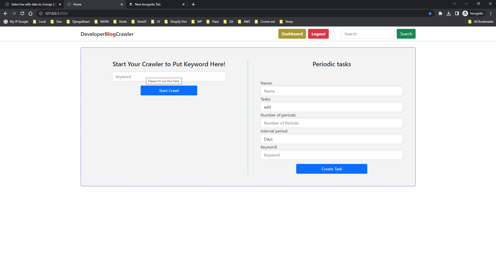
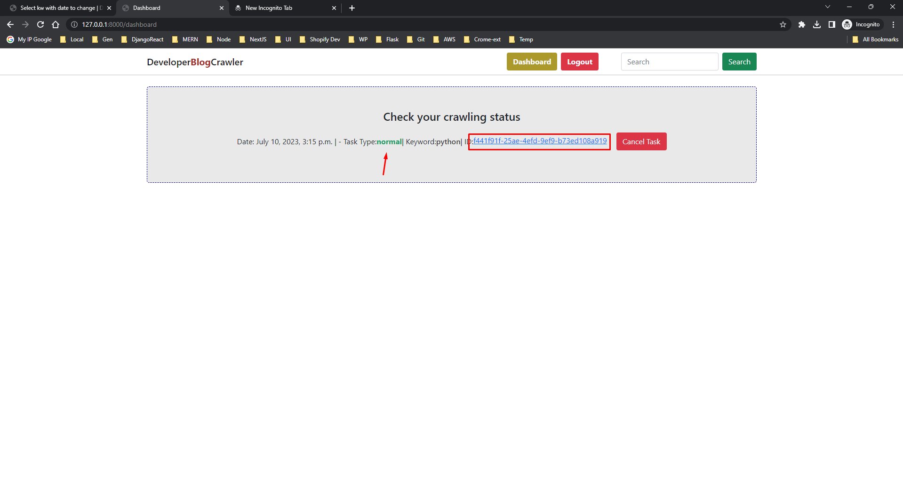
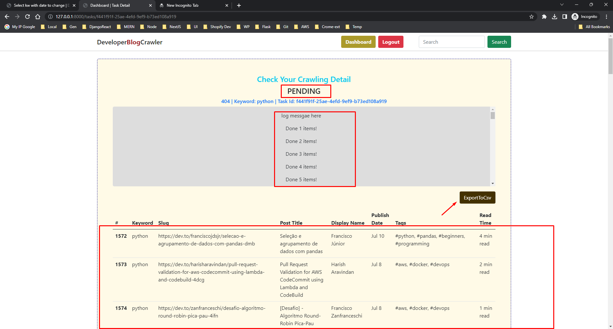
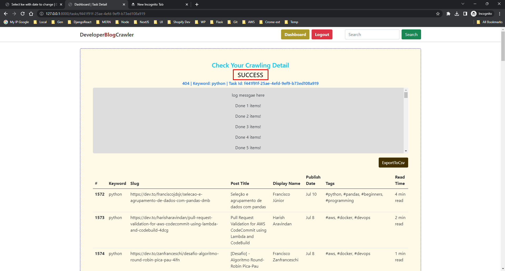
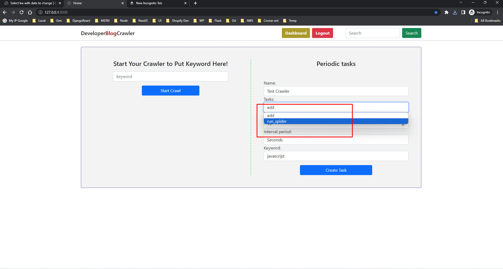
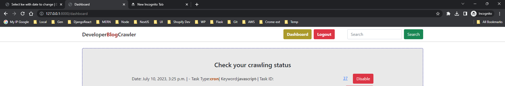
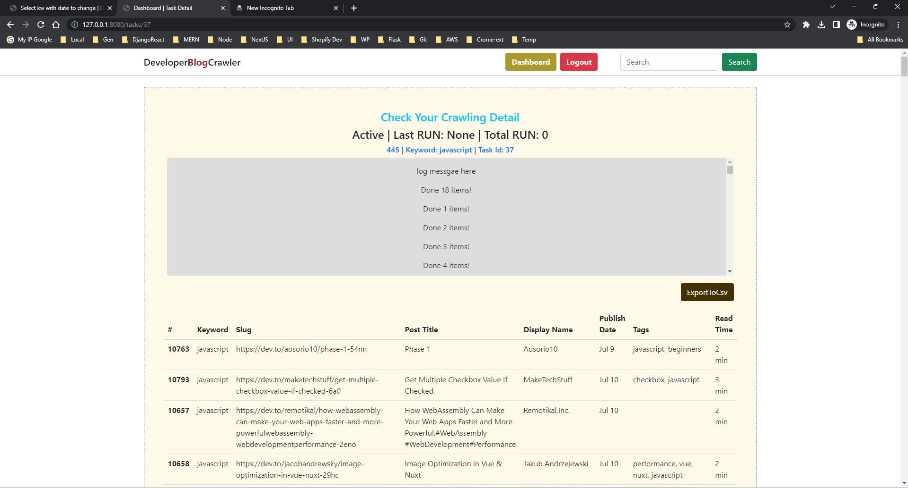
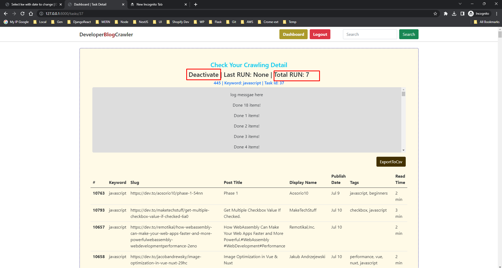
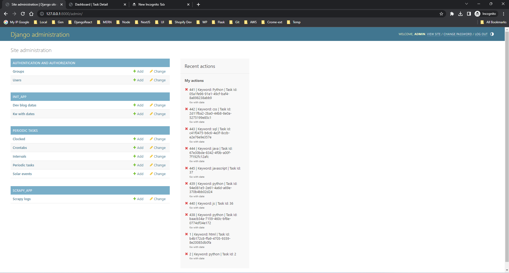

# Developer Blog Crawler

### This is a paid project

## Short Description

Hello, I am Mohammad, an experienced web scraping developer specializing in building robust and efficient crawling applications.
I have developed a paid web crawler application using cutting-edge technologies and frameworks such as Django, Scrapy, Selenium, Celery, Redis, PostgreSQL, and Docker.

Key Features:
• User-Friendly Interface: Users can easily input keywords and start crawling just by clicking
• Real-Time Status: Through integration with Django Channels and Celery, users can monitor the progress of their crawling tasks, view live logs, etc
• Advanced Scheduling Options: Users have the flexibility to schedule tasks to run at specific intervals and they can deactivate and cancel any tasks

I have utilized docker for containerization and ensuring seamless deployment and easy setup of the application in various environments.

## Short Video Overview

## Here some screenshots about this projects

